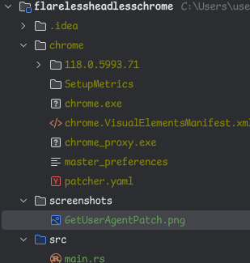

# FlarelessHeadlessChrome
Pass cloudflare turnstile challenge using patched chrome binary (currently on NT/Windows only).

## How it works
Currently, with [new headless mode](https://developer.chrome.com/articles/new-headless/) the only thing
that stops us from browsing sites behind CF waf is:
```js
console.log(navigator.webdriver) // prints true while using CDP
```
And ```HeadlessChrome``` useragent.

Trying to patch it using javascript is challenging, because it can be detected in 10000 ways. 

So I made simple patches to chrome binary using my tool [fabricbin](https://github.com/makindotcc/fabricbin) which
searches for code patterns and replaces it with defined in config (``windows_patch.yaml``).

## Applied patches

- blink::Navigator::webdriver
```c
return 0;
```
- embedder_support::GetUserAgentInternal


## Usage

1. Copy & paste chrome files to chrome/ directory:


2. Install [fabricbin](https://github.com/makindotcc/fabricbin)
```bash
cargo install --git https://github.com/makindotcc/fabricbin
```

3. Patch chrome.dll in our chrome/ directory.
```bash
# change version number '118.0.5993.71' to version you own
cp chrome/118.0.5993.71/chrome.dll chrome/118.0.5993.71/chrome_org.dll
```
Edit windows_patch.yaml with right ``input_file`` and ``output_file`` (change version number to your current
chrome version like ``./chrome/118.0.5993.71/chrome_org.dll`` to ``./chrome/110.0.2993.35/chrome_org.dll``)

```bash
fabricbin windows_patch.yaml
```

4. Done, you can browse websites behind cloudflare waf using 
modified chrome build with CDP and new headless (``--headless=new``). \
For example usage see [src/main.rs](src%2Fmain.rs)
